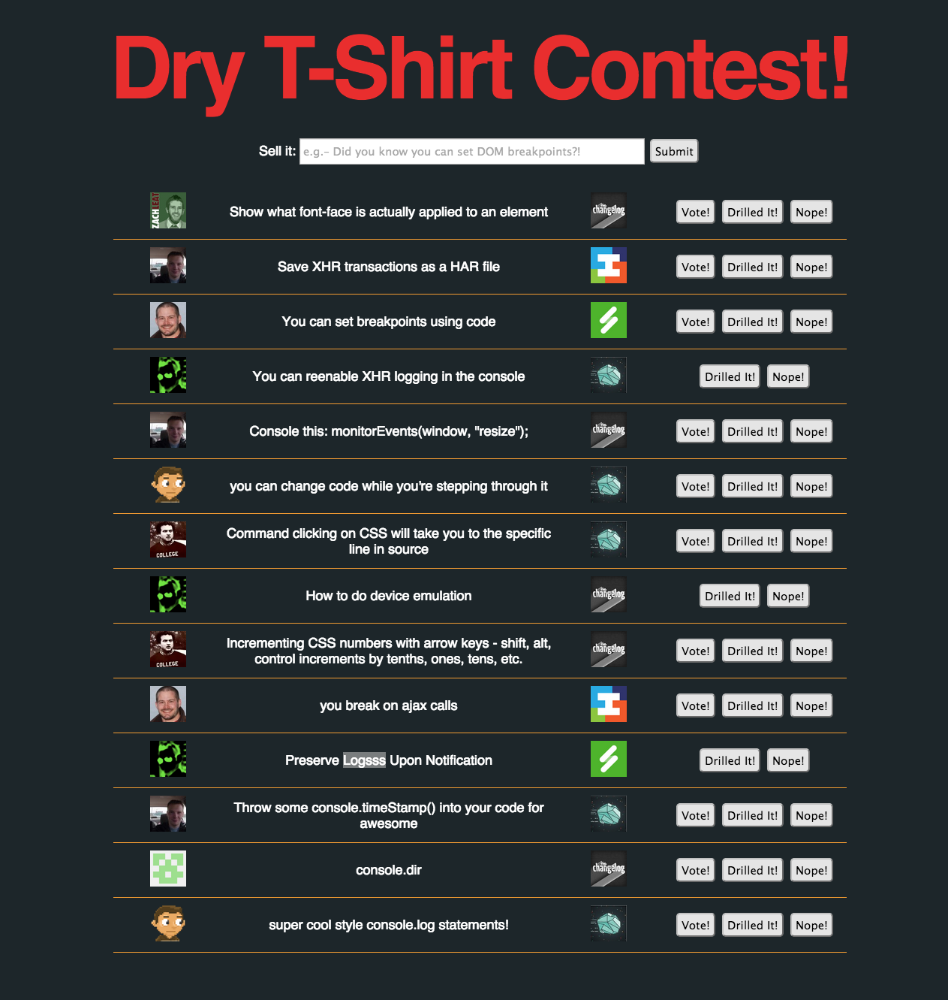

# DTSC

A little [AngularFire](https://github.com/firebase/angularfire) app to facilitate the Dry T-Shirt Contest I ran for NebraskaJS's [For Whom the Browser DevTools](http://www.meetup.com/nebraskajs/events/140479302/) meetup.

## Screenshot

We didn't make it through everybody's tips/tricks, so I guess the meetup was a success. Here's what the contest looked like at the end of the night:

## Configuring

If you want to reuse this code, you'll need to at least change:

1. firebase.json
2. the `baseUrl` set in `app/scripts/app.js`
3. the references to `github:8212`in `app/scripts/controllers/main.js`

`github:8212` is my GitHub id. It was a quick-and-dirty way to give me "admin access". Change this to your own GitHub id or refactor the code to work however you like. There is not much generic here as I coded this up in a few hot hours.

## License

[MIT por favor](http://opensource.org/licenses/MIT)
